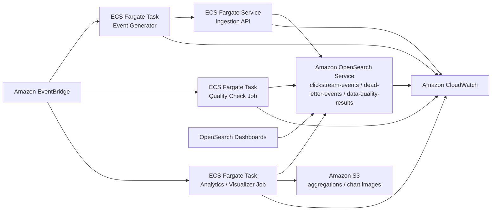

# AWS Architecture Design

이 프로젝트를 AWS에서 운영한다고 가정하면, 아래와 같은 구성을 사용할 수 있다.

## 서비스 선택 이유

- `ECS Fargate`: 현재 프로젝트가 Docker 기반이라 컨테이너 실행 환경으로 옮기기 쉽다.
- `Amazon OpenSearch Service`: 현재 저장소와 분석 방식이 OpenSearch 중심이라 운영 구조를 가장 자연스럽게 이어갈 수 있다.
- `Amazon S3`: 집계 JSON과 차트 이미지를 저장하기 좋고, 결과물을 장기 보관하기 쉽다.
- `Amazon EventBridge`: generator, quality, analytics 같은 주기 실행 작업을 스케줄링하기 좋다.
- `Amazon CloudWatch`: 컨테이너 로그와 OpenSearch 상태를 함께 모니터링하기 좋다.

## 가장 고민한 부분

가장 고민한 부분은 ingestion API 뒤에 별도 durable queue를 둘지 여부였다.  
현재 과제 구현은 in-memory queue로 충분하지만, 실제 AWS 운영 환경에서는 트래픽 급증이나 일시 장애를 고려하면 SQS나 Kinesis를 중간에 두는 것이 더 안전하다.  
다만 이번 설계에서는 현재 코드 구조를 최대한 자연스럽게 확장하는 방향을 우선해 `API → OpenSearch` 흐름을 유지하고, 이후 확장 시 queue를 추가하는 방향을 고려했다.
